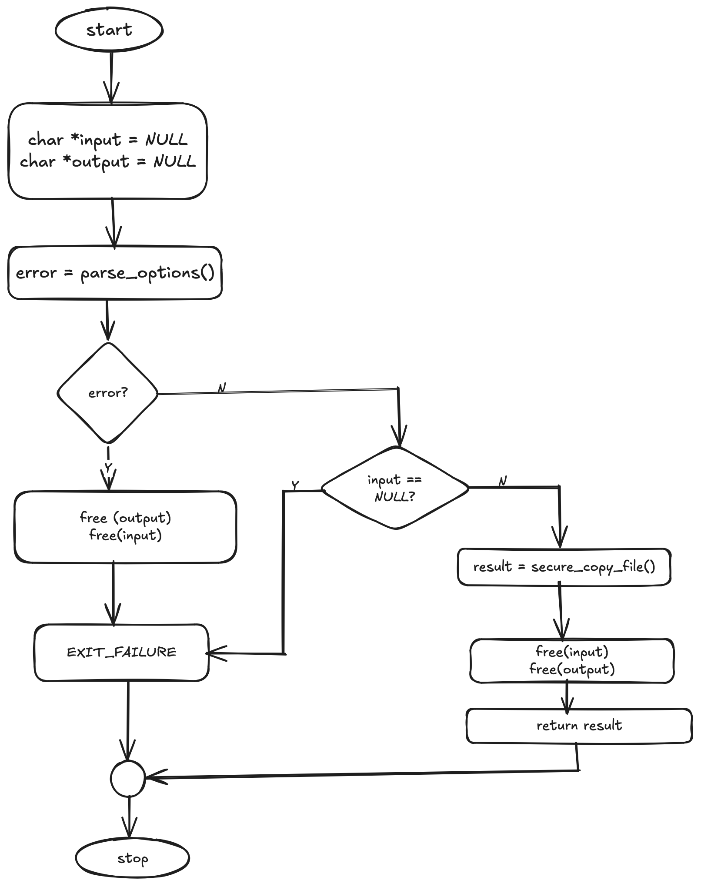
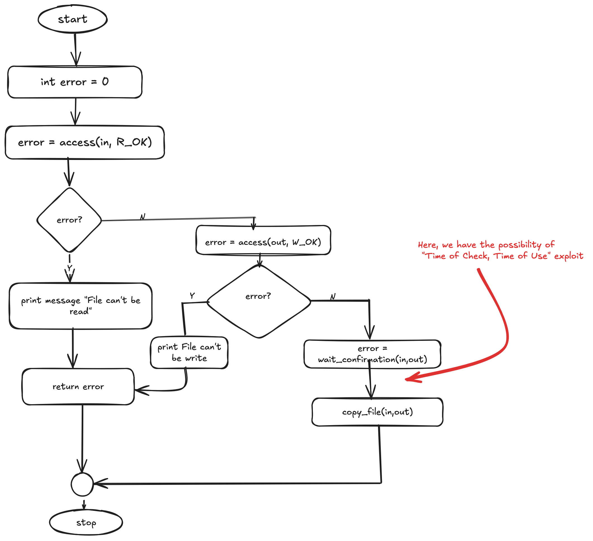
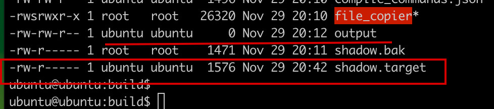
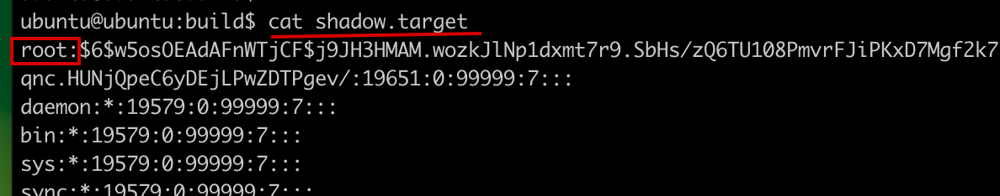
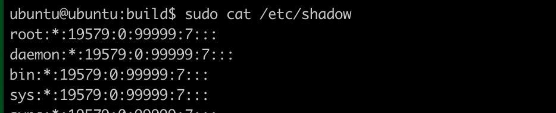
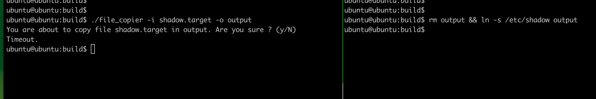
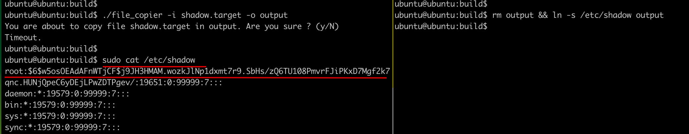

# Introduction
In this practical session, we will learn and apply our knowledge on race condition and how it's vulnerability may pose threas to system security, how one can exploit using such vulnerability, and their mitigations. This lab work will enable us to get hands-on on system level exploit and privilege escalation. Finally, we demonstrate on how we could achieve system level access with exploiting the vulnerability.

# Analysis
In this section, we first build our program to get its executable binary and observe it's behaviour by executing with different inputs. We will also explore if there are any threats or issues we can find potential to be exploited.

## Program Behaviour 
### Source Code Analysis
Our Directory hierarchy for project_v0 is:
```bash
project_v0
├── CMakeLists.txt
└── sources
    ├── functions
    │   ├── functions.c
    │   ├── functions.h
    │   └── hidden_functions
    │       ├── hidden_functions.c
    │       └── hidden_functions.h
    └── main.c
```
Program execution flow is as shown in the following diagram:



### Program Internal working
In the `secure_copy_file()` function, it is working as below:




## Threat
Analyzing the `wait_confirmation`, we opserved that it uses the poll system call to wait for user input for a specified duration (3 seconds). If the user does not respond within that time, the function returns a timeout, and the program proceeds to copy the input file to the output file. This behavior can be exploited by an attacker who can manipulate the output file path during the waiting period.

# Exploitation
To exploit the "Time of Use, Time of Check" vulnerability, we are going to replace `/etc/shadow` with our custom passwords. However, we can't directly do so as we don't have read/write permission to the `/etc/shadow` file. So the idea is:

- We will execute program as usual with our input file (where we have read access) and output file (where we have write access.)
- When our program asks us for our confirmation, we will remove our output file, and then create symlink with the same name to /point to `/etc/shadow` file, so that our program will copy content of input file to the `/etc/shadow` file

## Preparing our files:



Here:

  - output: is our output file
  - shadow.target: is our input file (with our passwords, to replace `/etc/shadow`)
  
  
  - Original shadow file has following content:
  
  

  - Once we could successfully exploit, then we should be able to write our password for the root user as in target shadow file.


## Program execution and attack
After preparing our files, and seeing their content, we now perform the exploit. To do so, we first create two panes in tmux session, and prepare our command. In one of pane, we will execute our program, and on another pane, we will prepare our command to remove and create symlink during the program taking time for confirmation.



Now, if we view the content of `/etc/shadow`, it should be replaced by the content of our shadow.target:



In this way, we can perform the exploit, to modify the system, and to gain the complete privilege of the system.


# Mitigation
**Description:** As program does not validate the output file path before writing to it, an attacker could create a symbolic link to a sensitive file (e.g., /etc/shadow) and exploit the timing of the file operations.

**Impact:**
This vulnerability could allow an attacker to overwrite sensitive files, leading to unauthorized access or privilege escalation. To prevent race conditions in your application, we thought about the following strategies:

**Input Validation:**
Validating user inputs in `parse_options` function, to ensure that the output file path does not point to sensitive files. 

```c
   if (strstr(out, "/etc/") != NULL) {
       fprintf(stderr, "Output file cannot be a system file.\n");
       return -1;
   }
```
What we are doing is that we check if the output file path contains `/etc/`, we pring an error message and free any allocated memory before returing an error. 
**Check for Symlinks:**
- Before writing to a file, in the `secure_copy_file` function, we can check if the target is a symlink and resolve it to its actual target. If it points to a sensitive file, deny the operation.

```c 
   struct stat statbuf;
   if (lstat(out, &statbuf) == 0 && S_ISLNK(statbuf.st_mode)) {
       fprintf(stderr, "Output file cannot be a symlink.\n");
       return -1;
   }
```
Here we added `lstat` to check if the output file is a `symbolic link`. If it is, we print an error message and return an error without proceeding with the copy operation.
- Also, we added the updated the `secure_copy_file` function where it check if the confirmation is received from the user to perform copying. Because this logic was not properly set in the `wait_confirmation` function. 
```c
error = wait_confirmation(in, out);
            if (error == 0){
                fprintf(stderr, "Operation cancelled.\n");
                return -1;
            } else if (error<0){
                return error;
            }
```
These modifications help us to mitigate the risk of `race conditions` and unauthorized access to sensitive data. 

# Conclusion
In this activity, we discovered a crucial weakness in the system, known as a "Time of Use, Time of Check" (TOCTOU) race condition, that could be used to alter important system files like /etc/shadow. This vulnerability shows how small mistakes in code can result in significant security threats.

To address this issue, we proposed robust mitigation strategies, including input validation, checking for symbolic links, and enforcing user confirmation logic more effectively. Implementing these strategies can significantly enhance the program's resilience against exploitation.

This activity highlights the significance of implementing proactive security measures like secure coding, thorough testing, and regular code reviews in order to develop strong and secure applications. By consistently implementing these practices, developers can avoid introducing vulnerabilities into crucial systems.


