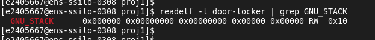
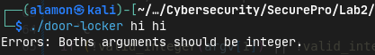
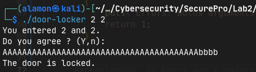
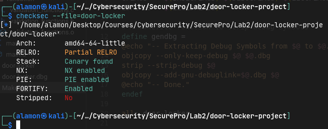

<!-- Remplacer 'en-GB' par 'fr' pour un document en français -->


# Introduction
In this practical session, we will learn and apply our knowledge on threat finndings, their mitigations using compilation options, or directly modifying the code itself. Lastly, we will present our some recommendation on improving the process.

# Options used for Legacy version
In this, we explored the various options that might have been used to compile our original door-locker binary. The compilation flags we will put into `LEGCFLAGS=` and the linker flags we will put `LEGLDFRLAGS=`.

## Compilation options (LEGCFLAGS)
### `-fno-stack-protector`
With the use of checksec tool, we saw that the provided `door-locker` binary doesn't have the canary. Thus, we assume that the flags `-fno-stack-protector` must have been used to disable stack protection. 
Stack protection is a security feature that helps prevent stack buffer overflow attacks. It works by inserting a stack canary value before the return address in a function's stack frame. During execution, the program checks this canary value before returning from a function. If the canary value has been altered (indicating a potential overflow), the program terminates with a security error.
For security purpose, stack-protection must be enabled. Thus, either `-fstack-protection` or `-fstack-protection-all` options must be used.

### `-D_FORTIFY_SOURCE=0`
`D_FORTIFY_SOURCE` option enables or disables additional buffer overflow checks for standard library functions. It checks the size of buffers and flags issues if they exceed their allocated memory. However, for security purpose, it's value must be 2 (or 3).


### `-fno-PIE`
This option disables the generation of position-independent code (PIC) for executables. The code is compiled with fixed memory addresses, meaning it assumes the program will always be loaded at a specific base address in memory.
Without PIE enabled, executables have fixed memory layouts, which attackers can exploit to craft reliable attacks like Return-Oriented Programming (ROP). Thus, this shouldn't be used for compilation, instead it should be enabled for better security.


## Linker options (LEGLDFRLAGS)
### `-m32`
We could check if the program was compiled as 32-bit or 64-bit by running **file door-locker**, which gives us ELF 32. It indicated the file type and architecture which in our case was ELF 32-bit (Linux). 
The `-m32` flag instructs the compiler and linker to generate a 32-bit binary, regardless of the host system's architecture (commonly 64-bit).

### `-z noexecstack`
The `-z noexecstack` option is a linker flag used to mark the program's stack segment as non-executable, enhancing security against stack-based exploits, such as stack buffer overflow attacks. We can see this with `readelf` command as:


### `-no-pie`
This option tells the linker to create a traditional non-position-independent executable, which won't support ASLR. Thus, it shouldn't be used, instead `-pie` must be used with `-fPIE` compilation option for enabling security supporting ASLR.


# Identified threats and their mitigation
In this section, we will try to implement the mitigations we proposed in previous report. 

## Mitigations for Buffer Overflow

To address the identified vulnerabilities, we implemented several patches to the source code. The first patch involved replacing the scanf function with fgets, which allowed for safer input handling by limiting the number of characters read. The modified code included checks to ensure that the input did not exceed the buffer size, thus mitigating the risk of buffer overflow.

```c
if (fgets(buffer, sizeof(buffer), stdin) == NULL) {
  return -1;
}

```


Furthermore, we added input validation to ensure that only numeric character were processed by the strtol function, which we noticed in binary reverse engineering. However, when looking at the source code we found out that atoi is used, which is less secure. We created **valid_integer()** function to check each character in the input, thereby preventing invalid input from being treated as numeric.

```c
if (!valid_integer(argv[1]) || !valid_integer(argv[2]))
        {
            puts("Errors: Boths arguments should be integer.");
            return 1;
        }
```

Output of the program is shown as below after implementing these changes:




## Mitigations for visibility of Sensitive function
The `fnR` function in our code is a critical piece that provides root access, and its presence in the compiled binary poses a significant security risk, especially since it was exploited through vulnerability like buffer overflows. Here’s a detailed breakdown of the function and the changes implemented to enhance security, along with recommendations for preventing such issues at the compilation level.
**Overview of fnR**
The original fnR function is designed to print a message indicating that root access has been granted. Using system() suggests that it was intended to spawn a root shell using a Python command. However, this approach is insecure because it can be exploited by attackers if they can manipulate the program's execution flow.
- **Replacement of system() with execve():** - The use of `execve()` is a more secure alternative to `system()`. The execve() function directly executes a program, providing better control over the environment and reducing the risk of command injection attacks. This change helps mitigate the risk associated with executing arbitrary shell commands.
```c
void fnR(void) {
    puts("Opened.");
    puts("Be careful, you are ROOT !\n");
    // Replacing the system() function with execve() function
    char *args[] = {"/bin/bash", "--norc", NULL};
    execve("/bin/bash", args, NULL);
    exit(0);
}
```
- **Access Control:** The function should ideally be made static or removed entirely if it is not used. This limits its visibility and accessibility, reducing the attack surface. If the function is not called anywhere in the program, it should be eliminated during the compilation process.

## Recommendations for Compilation and Security
To prevent the inclusion of dead code like **fnR()** in the final binary, to enable canaries to protect from buffer overflow, and to enhance the overall security, we considered these options:
- Compiler Optimization:
  Using optimization flags such as -O2 or -O3 to enable aggressive optimizations that can help eliminate dead code and improve performance. These optimizations can also help the compiler identify and remove unused functions. 
- Visibility Attributes:
  Even if the unused funciton somehow is important to keep in the program and it has some security threats, we could have declared sensitive functions as static to limit their visibility to the file scope. This prevents external access and reduces the risk of exploitation. By using `__attribute__((visibility("hidden")))` for the fnR that should not be exposed outside the compilation unit.
- Enabling canaries:
  By adding the ``-fstack-protector`` in the compilation we enabled the stack protection, which added canary values to the stack before return address. 
- Stack Protection:
  Using ``-D_FORTIFY_SOURCE=2`` enabled additional compile-time and runtime checks for vulnerable functions (like strcpy, sprintf, etc.). This helps prevent buffer overflows by aborting the program if a potential overflow is detected.
- No-Execute Stack:
  The ``-Wl,-z,noexecstack`` linker option marks the stack as non-executable. This prevents attackers from executing code that they may inject into the stack, which is a common technique in buffer overflow attacks.
- Position Independent Executables ``(PIE):``
  Compiling the program as a Position Independent Executable using the ``-fPIE`` flag. This, combined with Address Space Layout Randomization `(ASLR)`, randomizes the memory addresses used by the executable, making it harder for attackers to predict where their payloads will be executed.

  After compiling with all these changes `checksec` tool shows the following:




## Recommendation for future processes
There are few things to improve on the overall project devopment process from specification, design and conceptual to the development and deployment. 
- Initially, Developers should be aware of which functions are used/not-used for the operation of the program/system
- Developers should follow the `secure coding practices` such as not using vulnerable functions, sanitizing user inputs and so on.
- During compilation, security should be considered.
  

# Conclusion
Through examine the programming source code, we have identified the ways on how to improve the program from code-perspective and also from various compilation options. The implementation of effective patches such as replacing unsafe functions with safer alternatives and enhancing input validation demonstrates proactive to mitigating vulnerabilities. 
Additionally, the review of compilation options revealed an opportunities to strengthen the program's security by implementing secure flags. 


